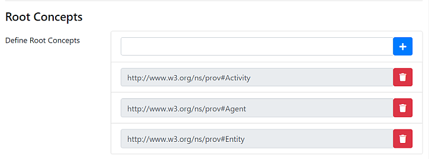

# Inception Management Notes

These notes are just so that we can remember what we were doing to get things working.

## Mass File Upload

During the massive upload of all of the text files for annotation, the system crashed with an `OutOfMemoryError: Java Heap Space` for (apparently) 6 files. Not sure if this is a problem with these particular files or with doing all of Ray's files back to back at once. The files were:

+ PMC6087614
+ PMC6128779
+ PMC6130867
+ PMC6150844
+ PMC6177312
+ PMC6205927

At least those were the only files listed as having errors.

## Manual Ontology Settings

For the imported ontology, we had to manually set root concepts:

These were:

+ [http://www.w3.org/ns/prov#Activity](http://www.w3.org/ns/prov#Activity)
+ [http://www.w3.org/ns/prov#Agent](http://www.w3.org/ns/prov#Agent)
+ [http://www.w3.org/ns/prov#Entity](http://www.w3.org/ns/prov#Entity)

## Layers

Before we got the system working, we had to create a new annotation layer. This followed the instructions from the Google group:

The settings are in the file `layer.json` in this folder.

### Feature

We also had to create a feature, called 'identifier' that had the following settings:

+ Name: identifier
+ Type: KB: Concept/Instance/Property
+ Options: Enabled, Visible, Show in Tooltip, Remember
+ Allowed Values: \<Any Concept/Instance\>
+ Knowledge Base: \<Any Knowledge Base\>
+ No settings for "scope" or "keybindings"

## CAS Doctor

Before the annotations started working we ran the "CAS Doctor" under project administration. It is not clear that that step is what made the annotations start working, but it is what we did. This was done after fixing the root concepts in the KB, and creating the layer in the annotations.
